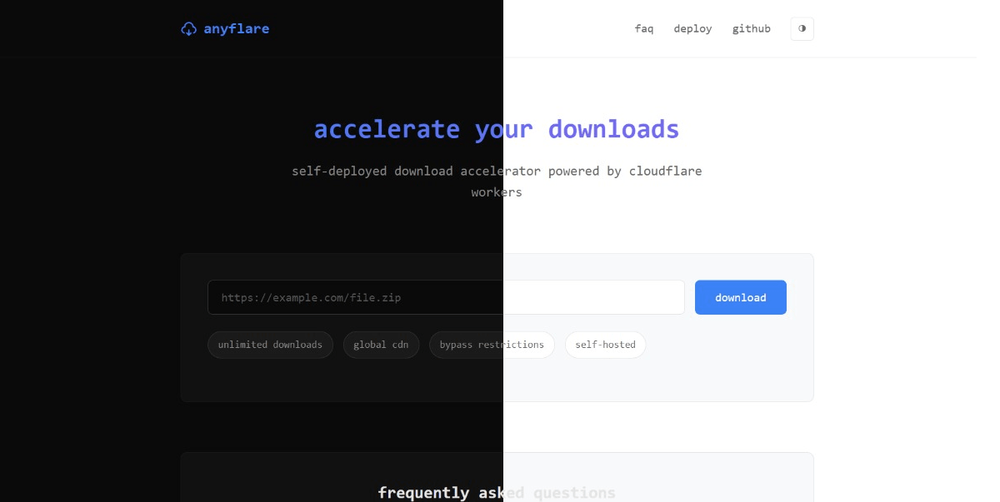

# Anyflare
Anyflare is a cloudflare worker proxy which you can deploy yourself to download anything through cloudflare.



## Features

- **Increase Speed**: Increase your slow download speed with Cloudflare CDN
- **Resumable Downloads**: Generates resumable download url for any url
- **Universal**: Works with most if not any download links

## Deployment

```
Easily deploy with Cloudflare Worker
```

[](https://deploy.workers.cloudflare.com/?url=https://github.com/ajshovon/anyflare)
